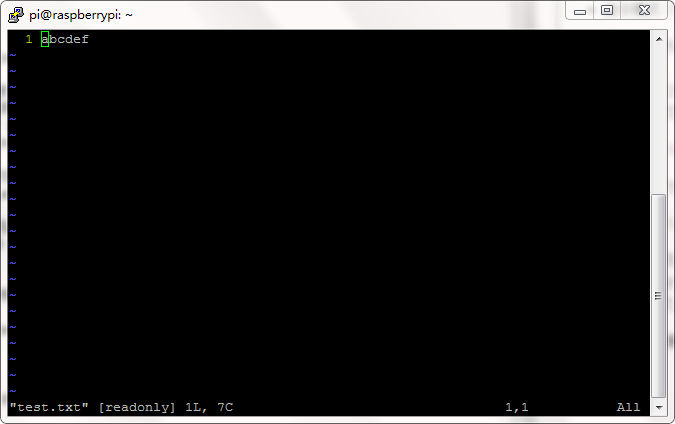
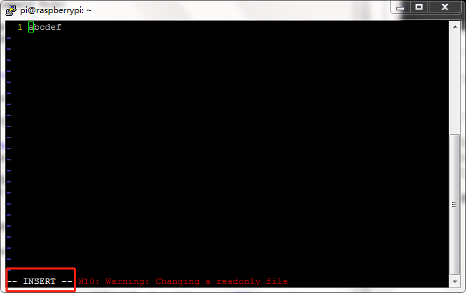
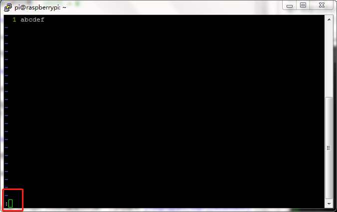
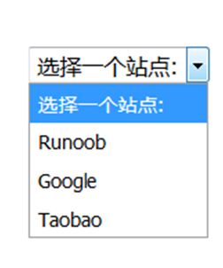
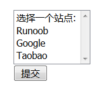
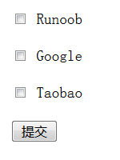

<a name="content">目录</a>

[学习笔记：PHP一周速成](#title)
- [写在前面](#firstly)
	- [测试Web服务器是否work](#test-web-server)
	- [测试PHP是否work](#test-php)
	- [web服务器默认工作目录](#web-server-workdir-default)
	- [linux文本编辑器的简单介绍](#txt-editor-introduct)
		- [nano](#nano)
		- [vim](#vim)
	- [编辑你的第一个php脚本](#edit-php-script)
- [PHP入门](#beginning-php)
	- [PHP 语法](#syntax)
	- [变量](#variable)
		- [变量作用域](#variable-scope)
	- [echo 和 print 语句](#echo-print)
	- [EOF(heredoc)](#heredoc)
	- [数据类型](#data-types)
	- [运算符](#operator)
	- [数据结构](#data-structure)
		- [常量](#constant)
		- [超级全局变量](#super-global-variable)
		- [魔术变量](#magic-variable)
		- [字符串变量](#string)
		- [数组](#array)
			- [数组排序](#array-sort)
	- [条件判断](#condition-judgment)
	- [循环](#loop)
	- [函数](#function)
	- [命名空间(namespace)](#namespace)
		- [子命名空间](#sub-namespace)
		- [命名空间使用](#use-namespace)
	- [面向对象](#Object-oriented)
		- [类定义](#class-define)
		- [创建对象](#setup-object)
		- [调用成员方法](#use-object)
		- [构造函数](#initial-func)
		- [析构函数](#destory-func)
		- [继承](#inherit)
		- [方法重写](#redefine-func)
		- [访问控制](#access-limit)
- [PHP进阶](#advanced-php)
	- [表单和用户输入](#form-and-input)
		- [表单处理](#form-process)
		- [获取下拉菜单的数据](#get-date-from-dropdown)
			- [下拉菜单单选](#one-selection)
			- [下拉菜单多选](#multi-selection)
		- [单选按钮表单](#radio)
		- [checkbox 复选框](#checkbox)
	- [表单验证](#form-validation)
		- [表单验证实例](#form-validation-example)
		- [预防XSS攻击：避免 $_SERVER["PHP_SELF"] 被利用](#defend-xss-attack)
		- [显示错误信息](#print-error)
		- [正则匹配：验证邮件和URL](#validate-email-url)
	- [收集表单数据：$_GET & $_POST](#get-and-post)
- [PHP高级教程](#master-php)
	- [date() 函数：格式化日期](#date)
	- [包含文件](#include-file)
	- [文件处理](#file-process)
	- [文件上传](#upload-file)
		- [文件上传表单](#upload-file-form)
		- [文件上传脚本](#upload-file-phpscript)
		- [文件上传限制](#upload-file-limit)
		- [保存被上传的文件](#upload-file-save)
- [PHP数据库操作](#php-database)
	- [连接 MySQL](#connect-mysql)
		- [MySQLi](#connect-mysql-mysqli)
		- [PDO](#connect-mysql-pdo)
		- [关闭连接](#connect-mysql-close)
	- [PHP-MySQL 操作数据库](#operate-database)
		- [执行单条SQL语句](#one-query)
			- [MySQLi](#operate-database-mysqli)
			- [PDO](#operate-database-pdo)
		- [执行多条SQL语句](#multi-query)
			- [普通方法](#common-method)
			- [使用预处理语句](#use-prepare-sentence)
				- [MySQLi](#use-prepare-sentence-mysqli)
				- [PDO](#use-prepare-sentence-pdo)

<h1 name="title">学习笔记：PHP一周速成</h1>

<p align="center"></p>

<a name="firstly"><h2>写在前面 [<sup>目录</sup>](#content)</h2></a>

<a name="test-web-server"><h4>测试Web服务器是否work [<sup>目录</sup>](#content)</h4></a>

在浏览器地址栏输入`ip:port`，回车。ip为树莓派服务器ip，port为树莓派服务器的web服务端口，比如ip为：124.16.111.23，port为9000，则输入：`124.16.111.23:9000`

若打开以下界面则说明Web服务器正常运行

<p align="center">

<a name="test-php"><h4>测试PHP是否work [<sup>目录</sup>](#content)</h4></a>

在浏览器地址栏输入`ip:port/phptest.php`

若打开以下界面则说明PHP正常运行

<p align="center">

<a name="web-server-workdir-default"><h4>web服务器默认工作目录 [<sup>目录</sup>](#content)</h4></a>

web服务器默认工作目录：直接在浏览器地址栏输入`ip:port`后，所进入的服务器文件系统的路径

默认工作目录为 `/var/www`

比如有以下树形结构的文件路径

```
/var/www/
|-- bioinfo-course
|-- html
|	|-- login1.html
|	|-- login.php
```
如果你想在浏览器上打开文件`login1.html`，怎么实现？
> 1. 用`ip:port`进入web服务器默认工作目录`/var/www`
> 2. 添加`login1.html`文件对应默认工作目录的相对路径：`html/login1.html`
> 3. 结合1和2中的信息，构造访问`login1.html`的URL：`ip:port/html/login1.html`

<p align="center">

**注意 ! ! !**

为了更好地归档和管理用户的数据，服务器管理员已经特地在web服务器默认工作目录`/var/www`下，创建了一个专门用于用户学习和练习PHP的文件夹`learningPHP`，请在该文件夹下再创建一个属于用户自己的文件夹，命令参考下面：

```
# 新建文件夹your_new_dir，具体文件夹名自行指定
$ mkdir /var/www/learningPHP/your_new_dir
# 修改文件夹操作权限，关闭同组成员的写权限
$ chmod g-w /var/www/learningPHP/your_new_dir
```

<a name="txt-editor-introduct"><h4>linux文本编辑器的简单介绍 [<sup>目录</sup>](#content)</h4></a>

<a name="nano"><h4>nano [<sup>目录</sup>](#content)</h4></a>

大家在Linux上用的文本编辑器，一般是**Vim**之类的，不过对于初学者可能门槛较高，学起来比较吃力，所以这里给初学者推荐一款比较容易入门上手的编辑器：nano

操作实例（比如有个文件`test.txt`)：
```
$ nano test.txt
```

<p align="center">

编辑方法：
> - 输入字符：直接敲键盘就行
> - 移动输入位置：键盘中的上下左右键
> - 编辑后保存：`ctrl+x` -> `y` -> 回车

<a name="vim"><h4>Vim [<sup>目录</sup>](#content)</h4></a>

vim是目前Linux操作系统下最流行的几款文本编辑器之一

Vim/vi 是一个功能强大的全屏幕文本编辑器，是 Linux/UNIX 上最常用的文本编辑器，它的作用是建立、编辑、显示文本文件。 Vim/vi 没有菜单，只有命令。

<li />启动Vim

```
$ vim filename
```

界面

<p align="center">

<li />Vim的三种模式及其切换

三种模式：

> - **命令模式**（Command Mode）
> 
> Vim 启动后的默认模式，所输入的任何内容都被解释成命令。在此模式中，用户可以执行一般的
编辑器命令，比如移动光标、删除文本等等。在命令模式中，有很多方法可以进入输入模式，比较普通的方式是按“a”（append，追加）键或者“i”（insert，插入）键。
>
> **在该模式下我一般不会做太多操作，除了一些光标移动操作**
> > - 移动到文件末尾：`shift + g`
> > - 移动到当前行的行首：`shift + ^`
> > - 移动到当前行的行尾：`shift + $`
>
> 
> 
> - **输入模式**（Insert Mode）
> 
> 在此模式中，才能对文本进行正常的编辑
>
> 
> 
> - **末行模式**（Last Line Mode） 
> 
> 在末行模式中可以输入会被解释并执行的命令。例如执行命令（“:”键），搜索（“/”和“?”
键）或者过滤命令（“!”键）。在命令执行之后， Vim 返回到末行模式之前的模式，通常是普通模式（命令模式）。
>
> **在该模式下我一般不会做太多操作，除了保存文件及退出**
> > - 保存文件：`w`
> > - 退出：`q`
> > - 保存并退出：`wq`
> > - 强制退出，不保存文件：`q!`
> 
> 

三个模式之间的转换

<p align="center">

注意：**输入模式与末行模式之间无法直接转换，需要命令模式作为中介**

<a name="edit-php-script"><h4>编辑你的第一个php脚本 [<sup>目录</sup>](#content)</h4></a>

打开文本编辑器，这里以nano为例，这里将文件命名为`test.php`（文件名自行定义，但后缀必须是php）：

```
$ nano /var/www/learningPHP/lianm/test.php
```

然后在编辑器中输入以下PHP脚本语句

```
<?php
echo "Hello World!";
?> 
```

然后保存：`ctrl+x` -> `y` -> 回车。

在浏览器中访问你刚才编辑好的php脚本，在浏览器地址栏输入该脚本的URL：`124.16.111.23:9000/learningPHP/lianm/test.php`

<p align="center">

运行成功，congratulation ！ ！ ！

<a name="syntax"><h3>PHP 语法 [<sup>目录</sup>](#content)</h3></a>

<li>基本的 PHP 语法：</li>

```
<?php
// PHP 代码
?> 
```

PHP 中的每个代码行都**必须以分号结束**。分号是一种分隔符，用于把指令集区分开来。

通过 PHP，有两种在浏览器输出文本的基础指令：echo 和 print。
<br>
<li>注释</li>

```
<?php
// 这是 PHP 单行注释

/*
这是
PHP 多行
注释
*/
?>
```
<a name="beginning-php"><h2>PHP入门 [<sup>目录</sup>](#content)</h2></a>

<a name="variable"><h3>变量 [<sup>目录</sup>](#content)</h3></a>

```
<?php
$x=5;
$y=6;
$z=$x+$y;
echo $z;
?>
```

<a name="variable-scope"><h4>变量作用域 [<sup>目录</sup>](#content)</h4></a>

<li>全局变量</li>

在所有函数外部定义的变量，拥有全局作用域。要在一个函数中访问一个全局变量，需要使用 global 关键字。 

```
<?php
$x=5;
$y=10;
 
function myTest()
{
    global $x,$y;
    $y=$x+$y;
}
 
myTest();
echo $y; // 输出 15
?>
```

PHP 将所有全局变量存储在一个名为 $GLOBALS[index] 的数组中。 index 保存变量的名称。这个数组可以在函数内部访问，也可以直接用来更新全局变量。

```
<?php
$x=5;
$y=10;
 
function myTest()
{
    $GLOBALS['y']=$GLOBALS['x']+$GLOBALS['y'];
} 
 
myTest();
echo $y;
?>
```

<br>
<li>局部变量</li>

在 PHP 函数内部声明的变量是局部变量，仅能在函数内部访问

<br>
<li>Static 作用域</li>

当一个函数完成时，它的所有变量通常都会被删除。然而，有时候您希望某个局部变量不要被删除。

要做到这一点，请在您第一次声明变量时使用 static 关键字：

```
<?php
function myTest()
{
    static $x=0;
    echo $x;
    $x++;
}
 
myTest();
myTest();
myTest();
?>

# 输出结果： 012
```

<a name="echo-print"><h3>echo 和 print 语句 [<sup>目录</sup>](#content)</h3></a>

echo 和 print 区别:

> - echo - 可以输出一个或多个字符串，字符串之间用**逗号**隔开
> - print - 只允许输出一个字符串，返回值总为 1

<a name="heredoc"><h3>EOF (heredoc) [<sup>目录</sup>](#content)</h3></a>

```
<?php
echo <<<EOF
    <h1>我的第一个标题</h1>
    <p>我的第一个段落。</p>
EOF;
// 结束需要独立一行且前后不能空格
?>
```

> 1. 必须后接分号，否则编译通不过。
> 2. EOF 可以用任意其它字符代替，只需保证结束标识与开始标识一致。
> 3. **结束标识必须顶格独自占一行(即必须从行首开始，前后不能衔接任何空白和字符)。**
> 4. 开始标识可以不带引号或带单双引号，不带引号与带双引号效果一致，解释内嵌的变量和转义符号，带单引号则不解释内嵌的变量和转义符号。
> 5. 当内容需要内嵌引号（单引号或双引号）时，不需要加转义符，本身对单双引号转义，此处相当与q和qq的用法。

<a name="data-types"><h3>数据类型 [<sup>目录</sup>](#content)</h3></a>

<li />字符串

将任何文本放在单引号和双引号中

<li />整型

整型可以用三种格式来指定：十进制， 十六进制（ 以 0x 为前缀）或八进制（前缀为 0）。

var_dump( ) 函数返回变量的数据类型和值

<li />浮点型

浮点数是带小数部分的数字，或是指数形式。

<li />布尔型

布尔型可以是 TRUE 或 FALSE。

<li />数组

数组可以在一个变量中存储多个值。

```
$cars=array("Volvo","BMW","Toyota");
```

<li />对象


在 PHP 中，对象必须声明。首先，你必须使用class关键字声明类对象。类是可以包含**属性**和**方法**的结构。

``` 
<?php
class Car
{
  var $color;
  function Car($color="green") {
    $this->color = $color;
  }
  function what_color() {
    return $this->color;
  }
}
?> 
```

以上实例中PHP关键字this就是指向当前对象实例的指针，不指向任何其他对象或类。

<a name="operator"><h3>运算符 [<sup>目录</sup>](#content)</h3></a>

- 逻辑运算符

> - 与：`and` 或 `&&`
> 
> - 或：`or` 或 `||`
> 
> - 异或：`xor`，有且仅有一个为 true，则返回 true

- 数组运算符

|	运算符	|	名称	|	描述	|
|:---|:---|:---|
|	x + y	|	集合	|	x 和 y 的集合	|
|	x == y	|	相等	|	如果 x 和 y 具有相同的键/值对，则返回 true	|
|	x === y	|	恒等	|	如果 x 和 y 具有相同的键/值对，且顺序相同类型相同，则返回 true	|
|	x != y	|	不相等	|	如果 x 不等于 y，则返回 true	|
|	x <> y	|	不相等	|	如果 x 不等于 y，则返回 true	|
|	x !== y	|	不恒等	|	如果 x 不等于 y，则返回 true	|

- 三元运算符

```
(expr1) ? (expr2) : (expr3) 
```

对 expr1 求值为 TRUE 时的值为 expr2，在 expr1 求值为 FALSE 时的值为 expr3。

自 PHP 5.3 起，可以省略三元运算符中间那部分。表达式 expr1 ?: expr3 在 expr1 求值为 TRUE 时返回 expr1，否则返回 expr3。常用在判断 $_GET 请求中含有 user 值

```
<?php
// 如果 $_GET['user'] 不存在返回 'nobody'，否则返回 $_GET['user'] 的值
$username = $_GET['user'] ?? 'nobody';
// 类似的三元运算符
$username = isset($_GET['user']) ? $_GET['user'] : 'nobody';
?>
```

- 组合比较符(PHP7+)

组合比较运算符，英文叫作combined comparison operator，符号为<=>，它有一个形象的名字，叫作**太空船操作符**。组合比较运算符可以轻松实现两个变量的比较。

```
$c = $a <=> $b
```

> - 如果$a > $b，$c 的值为1
> - 如果$a == $b，$c 的值为0
> - 如果$a < $b，$c 的值为-1

<a name="data-structure"><h3>数据结构 [<sup>目录</sup>](#content)</h3></a>

<a name="constant"><h4>常量 [<sup>目录</sup>](#content)</h4></a>

常量是一个简单值的标识符。该值在脚本中不能改变。常量在整个脚本中都可以使用。

```
define ( string $name , mixed $value [, bool $case_insensitive = false ] )
```

> - name：必选参数，常量名称，即标志符。
> - value：必选参数，常量的值。
> - case_insensitive ：可选参数，如果设置为 TRUE，该常量则大小写不敏感。默认是大小写敏感的。

```
<?php
// 区分大小写的常量名
define("GREETING", "欢迎访问 Runoob.com");
echo GREETING;    // 输出 "欢迎访问 Runoob.com"
echo '<br>';
echo greeting;   // 输出 "greeting"
?>
```

<a name="super-global-variable"><h4>超级全局变量 [<sup>目录</sup>](#content)</h4></a>

PHP中预定义了几个超级全局变量（superglobals） ，这意味着它们在一个脚本的全部作用域中都可用

- **$GLOBALS**

$GLOBALS 是一个包含了全部变量的全局组合数组。变量的名字就是数组的键。

```
<?php 
$x = 75; 
$y = 25;
 
function addition() 
{ 
    $GLOBALS['z'] = $GLOBALS['x'] + $GLOBALS['y']; 
}
 
addition(); 
echo $z; 
?>
```

- **$_SERVER**

$_SERVER 是一个包含了诸如**头信息(header)、路径(path)、以及脚本位置(script locations)**等等信息的数组。这个数组中的项目由 Web 服务器创建。不能保证每个服务器都提供全部项目；服务器可能会忽略一些，或者提供一些没有在这里列举出来的项目。

|	元素/代码	|	描述	|
|:---|:---|
|	$_SERVER['PHP_SELF']	|	当前执行脚本的文件名，与 document root 有关。例如，在地址为 http://example.com/test.php/foo.bar 的脚本中使用 $_SERVER['PHP_SELF'] 将得到 /test.php/foo.bar。__FILE__ 常量包含当前(例如包含)文件的完整路径和文件名。 从 PHP 4.3.0 版本开始，如果 PHP 以命令行模式运行，这个变量将包含脚本名。之前的版本该变量不可用。	|
|	$_SERVER['GATEWAY_INTERFACE']	|	服务器使用的 CGI 规范的版本；例如，"CGI/1.1"。	|
|	$_SERVER['SERVER_ADDR']	|	当前运行脚本所在的服务器的 IP 地址。	|
|	$_SERVER['SERVER_NAME']	|	当前运行脚本所在的服务器的主机名。如果脚本运行于虚拟主机中，该名称是由那个虚拟主机所设置的值决定。(如: www.runoob.com)	|
|	$_SERVER['SERVER_SOFTWARE']	|	服务器标识字符串，在响应请求时的头信息中给出。 (如：Apache/2.2.24)	|
|	$_SERVER['SERVER_PROTOCOL']	|	请求页面时通信协议的名称和版本。例如，"HTTP/1.0"。	|
|	$_SERVER['REQUEST_METHOD']	|	访问页面使用的请求方法；例如，"GET", "HEAD"，"POST"，"PUT"。	|
|	$_SERVER['REQUEST_TIME']	|	请求开始时的时间戳。从 PHP 5.1.0 起可用。 (如：1377687496)	|
|	$_SERVER['QUERY_STRING']	|	query string（查询字符串），如果有的话，通过它进行页面访问。	|
|	$_SERVER['HTTP_ACCEPT']	|	当前请求头中 Accept: 项的内容，如果存在的话。	|
|	$_SERVER['HTTP_ACCEPT_CHARSET']	|	当前请求头中 Accept-Charset: 项的内容，如果存在的话。例如："iso-8859-1,*,utf-8"。	|
|	$_SERVER['HTTP_HOST']	|	当前请求头中 Host: 项的内容，如果存在的话。	|
|	$_SERVER['HTTP_REFERER']	|	引导用户代理到当前页的前一页的地址（如果存在）。由 user agent 设置决定。并不是所有的用户代理都会设置该项，有的还提供了修改 HTTP_REFERER 的功能。简言之，该值并不可信。)	|
|	$_SERVER['HTTPS']	|	如果脚本是通过 HTTPS 协议被访问，则被设为一个非空的值。	|
|	$_SERVER['REMOTE_ADDR']	|	浏览当前页面的用户的 IP 地址。	|
|	$_SERVER['REMOTE_HOST']	|	浏览当前页面的用户的主机名。DNS 反向解析不依赖于用户的 REMOTE_ADDR。	|
|	$_SERVER['REMOTE_PORT']	|	用户机器上连接到 Web 服务器所使用的端口号。	|
|	$_SERVER['SCRIPT_FILENAME']	|	当前执行脚本的绝对路径。	|
|	$_SERVER['SERVER_ADMIN']	|	该值指明了 Apache 服务器配置文件中的 SERVER_ADMIN 参数。如果脚本运行在一个虚拟主机上，则该值是那个虚拟主机的值。(如：someone@runoob.com)	|
|	$_SERVER['SERVER_PORT']	|	Web 服务器使用的端口。默认值为 "80"。如果使用 SSL 安全连接，则这个值为用户设置的 HTTP 端口。	|
|	$_SERVER['SERVER_SIGNATURE']	|	包含了服务器版本和虚拟主机名的字符串。	|
|	$_SERVER['PATH_TRANSLATED']	|	当前脚本所在文件系统（非文档根目录）的基本路径。这是在服务器进行虚拟到真实路径的映像后的结果。	|
|	$_SERVER['SCRIPT_NAME']	|	包含当前脚本的路径。这在页面需要指向自己时非常有用。__FILE__ 常量包含当前脚本(例如包含文件)的完整路径和文件名。	|
|	$_SERVER['SCRIPT_URI']	|	URI 用来指定要访问的页面。例如 "/index.html"。	|

- **$_REQUEST**

PHP $_REQUEST 用于收集HTML表单提交的数据。

```
<html>
<body>

<form method="post" action="<?php echo $_SERVER['PHP_SELF'];?>">
Name: <input type="text" name="fname">
<input type="submit">
</form>

<?php
$name = $_REQUEST['fname'];
echo $name;
?>

</body>
</html>
```

当用户通过点击 "Submit" 按钮提交表单数据时, 表单数据将发送至`<form>`标签中 action 属性中指定的脚本文件。	`$_SERVER['PHP_SELF']`说明指定的脚本文件为当前脚本文件。
 
想了解更多关于html中的表单知识，请点 [这里](http://www.w3school.com.cn/html/html_forms.asp)
 
 - **$_POST**

$_POST 被广泛应用于收集表单数据，在HTML form标签的指定该属性："method="post"。

```
<html>
<body>

<form method="post" action="<?php echo $_SERVER['PHP_SELF'];?>">
Name: <input type="text" name="fname">
<input type="submit"》
</form>

<?php
$name = $_POST['fname'];
echo $name;
?>

</body>
</html>
```

- **$_GET**

$_GET 同样被广泛应用于收集表单数据，在HTML form标签的指定该属性："method="get"。

$_GET 也可以收集URL中发送的数据。

> 1\. 在web服务器的对应目录下创建`get_test.php`文件
> 
> ```
> <html>
> <body>
> 
> <?php
> echo "Study " . $_GET['subject'] . " at " . $_GET['web'];
> ?>
> 
> </body>
> </html>
> ```
> 2\. 用URL向`get_test.php`文件发送的数据。
> 
> 在浏览器地址栏输入`ip:port/learningPHP/your_dir/get_test.php?subject=PHP&web=runoob.com`
> 
> 得到输出：`Study PHP at runoob.com `

<a name="magic-variable"><h4>魔术变量 [<sup>目录</sup>](#content)</h4></a>

PHP 向它运行的任何脚本提供了大量的预定义常量。

不过很多常量都是由不同的扩展库定义的，只有在加载了这些扩展库时才会出现，或者动态加载后，或者在编译时已经包括进去了。

有八个魔术常量它们的值随着它们在代码中的位置改变而改变。

|变量|解释|
|:---|:---|
|\_\_LINE\_\_|文件中的当前行号|
|\_\_FILE\_\_|文件的完整路径和文件名。如果用在被包含文件中，则返回被包含的文件名|
|\_\_DIR\_\_|文件所在的目录。如果用在被包括文件中，则返回被包括的文件所在的目录|
|\_\_FUNCTION\_\_|函数名称|
|\_\_CLASS\_\_|类的名称，本常量返回该类被定义时的名字（区分大小写）|
|\_\_TRAIT\_\_|Trait 的名字|
|\_\_METHOD\_\_|类的方法名，返回该方法被定义时的名字（区分大小写）|
|\_\_NAMESPACE\_\_|当前命名空间的名称（区分大小写）。此常量是在编译时定义的|

<a name="string"><h4>字符串变量 [<sup>目录</sup>](#content)</h4></a>

- 字符串连接：

运算符 (.) 用于把两个字符串值连接起来。

```
 <?php
$txt1="Hello world!";
$txt2="What a nice day!";
echo $txt1 . " " . $txt2;
?> 
```

- strlen( )：返回字符串的长度（字符数）

- strpos( )：用于在字符串内查找一个字符或一段指定的文本

如果在字符串中找到匹配，该函数会返回第一个匹配的字符位置。如果未找到匹配，则返回 FALSE。

完整参考手册请点 [这里](http://www.runoob.com/php/php-ref-string.html)

<a name="array"><h4>数组 [<sup>目录</sup>](#content)</h4></a>

在 PHP 中，有三种类型的数组：
> - 数值数组 - 带有数字 ID 键的数组
> - 关联数组 - 带有指定的键的数组，每个键关联一个值
> - 多维数组 - 包含一个或多个数组的数组

- 数值数组

创建数值数组

```
$cars=array("Volvo","BMW","Toyota");
```

count( )：获取数组的长度

- 关联数组

创建关联数组

```
$age=array("Peter"=>"35","Ben"=>"37","Joe"=>"43");
```

使用指定的键访问数组中对应的键值

```
<?php
$age=array("Peter"=>"35","Ben"=>"37","Joe"=>"43");
echo "Peter is " . $age['Peter'] . " years old.";
?>
```

- 多维数组

多维数组是包含一个或多个数组的数组。

```
<?php
// 二维数组:
$cars = array
(
    array("Volvo",100,96),
    array("BMW",60,59),
    array("Toyota",110,100)
);
?>
```

访问多维数组的值：`$sites['runoob'][0]`

<a name="array-sort"><h4>数组排序 [<sup>目录</sup>](#content)</h4></a>

> - sort() - 对数组进行升序排列
> - rsort() - 对数组进行降序排列
> - asort() - 根据关联数组的值，对数组进行升序排列
> - ksort() - 根据关联数组的键，对数组进行升序排列
> - arsort() - 根据关联数组的值，对数组进行降序排列
> - krsort() - 根据关联数组的键，对数组进行降序排列

<a name="condition-judgment"><h3>条件判断 [<sup>目录</sup>](#content)</h3></a>

- If...Else 语句

```
if (条件)
{
	if 条件成立时执行的代码;
}
elseif (条件)
{
	elseif 条件成立时执行的代码;
}
else
{
	条件不成立时执行的代码;
} 
```

- Switch 语句

```
<?php
switch (n)
{
case label1:
    如果 n=label1，此处代码将执行;
    break;
case label2:
    如果 n=label2，此处代码将执行;
    break;
default:
    如果 n 既不等于 label1 也不等于 label2，此处代码将执行;
}
?>
```

<a name="loop"><h3>循环 [<sup>目录</sup>](#content)</h3></a>

- **while 循环**

```
while (条件)
{
    要执行的代码;
}
```

- **do...while 语句**

首先执行一次代码块，然后在**指定的条件成立时重复这个循环**

```
do
{
    要执行的代码;
}
while (条件);
```

- **for 循环**

```
for (初始值; 条件; 增量)
{
    要执行的代码;
}
```

- **foreach 循环**

每进行一次循环，当前数组元素的值就会被赋值给 $value 变量（数组指针会逐一地移动），在进行下一次循环时，您将看到数组中的下一个值。

```
foreach ($array as $value)
{
    要执行代码;
}
```

<a name="function"><h3>函数 [<sup>目录</sup>](#content)</h3></a>

- **创建 PHP 函数**

```

<?php
function functionName()
{
    // 要执行的代码
}
?>
```

- **返回值**

如需让函数返回一个值，请使用 return 语句。

<a name="namespace"><h3>命名空间(namespace) [<sup>目录</sup>](#content)</h3></a>

 PHP 命名空间可以解决以下两类问题：

- 用户编写的代码与PHP内部的类/函数/常量或第三方类/函数/常量之间的名字冲突。
- 为很长的标识符名称(通常是为了缓解第一类问题而定义的)创建一个别名（或简短）的名称，提高源代码的可读性。

命名空间通过关键字namespace 来声明，**命名空间必须是程序脚本的第一条语句**

```
<?php  
// 定义代码在 'MyProject' 命名空间中  
namespace MyProject;  
 
// ... 代码 ...  
```

可以在同一个文件中定义不同的命名空间代码

```
<?php
namespace MyProject {
    const CONNECT_OK = 1;
    class Connection { /* ... */ }
    function connect() { /* ... */  }
}

namespace AnotherProject {
    const CONNECT_OK = 1;
    class Connection { /* ... */ }
    function connect() { /* ... */  }
}
?>
```

将**全局的非命名空间**中的代码与**命名空间**中的代码组合在一起，只能使用大括号形式的语法。全局代码必须用一个不带名称的 namespace 语句加上大括号括起来

```
<?php
namespace MyProject {

const CONNECT_OK = 1;
class Connection { /* ... */ }
function connect() { /* ... */  }
}

namespace { // 全局代码
session_start();
$a = MyProject\connect();
echo MyProject\Connection::start();
}
?>
```

在声明命名空间之前唯一合法的代码是用于定义源文件编码方式的 declare 语句。所有非 PHP 代码包括空白符都不能出现在命名空间的声明之前。

```
<?php
declare(encoding='UTF-8'); //定义多个命名空间和不包含在命名空间中的代码
namespace MyProject {

const CONNECT_OK = 1;
class Connection { /* ... */ }
function connect() { /* ... */  }
}

namespace { // 全局代码
session_start();
$a = MyProject\connect();
echo MyProject\Connection::start();
}
?>
```

<a name="sub-namespace"><h4>子命名空间 [<sup>目录</sup>](#content)</h4></a>

与目录和文件的关系很象，PHP 命名空间也允许指定层次化的命名空间的名称。因此，命名空间的名字可以使用分层次的方式定义： 

```
<?php
namespace MyProject\Sub\Level;  //声明分层次的单个命名空间

const CONNECT_OK = 1;
class Connection { /* ... */ }
function Connect() { /* ... */  }

?>
```

上面的例子创建了常量 MyProject\Sub\Level\CONNECT_OK，类 MyProject\Sub\Level\Connection 和函数 MyProject\Sub\Level\Connect。 

<a name="use-namespace"><h4>命名空间使用 [<sup>目录</sup>](#content)</h4></a>

PHP 命名空间中的类名可以通过三种方式引用

- 非限定名称，或不包含前缀的类名称

例如 $a=new foo(); 或 foo::staticmethod();。如果当前命名空间是 currentnamespace，foo 将被解析为 currentnamespace\foo。如果使用 foo 的代码是全局的，不包含在任何命名空间中的代码，则 foo 会被解析为foo。

- 限定名称,或包含前缀的名称

例如 $a = new subnamespace\foo(); 或 subnamespace\foo::staticmethod();。如果当前的命名空间是 currentnamespace，则 foo 会被解析为 currentnamespace\subnamespace\foo。如果使用 foo 的代码是全局的，不包含在任何命名空间中的代码，foo 会被解析为subnamespace\foo。

- 完全限定名称，或包含了全局前缀操作符的名称

例如， $a = new \currentnamespace\foo(); 或 \currentnamespace\foo::staticmethod();。在这种情况下，foo 总是被解析为代码中的文字名(literal name)currentnamespace\foo。

<a name="Object-oriented"><h3>面向对象 [<sup>目录</sup>](#content)</h3></a>

<a name="class-define"><h4>类定义 [<sup>目录</sup>](#content)</h4></a>

```
<?php
class phpClass {
  var $var1;
  var $var2 = "constant string";
  
  function myfunc ($arg1, $arg2) {
     [..]
  }
  [..]
}
?>
```

实例：

```
<?php
class Site {
  /* 成员变量 */
  var $url;
  var $title;
  
  /* 成员函数 */
  function setUrl($par){
     $this->url = $par;
  }
  
  function getUrl(){
     echo $this->url . PHP_EOL;
  }
  
  function setTitle($par){
     $this->title = $par;
  }
  
  function getTitle(){
     echo $this->title . PHP_EOL;
  }
}
?>
```

<a name="setup-object"><h4>创建对象 [<sup>目录</sup>](#content)</h4></a>

```
$runoob = new Site;
$taobao = new Site;
$google = new Site;
```

<a name="use-object"><h4>调用成员方法 [<sup>目录</sup>](#content)</h4></a>


```
$runoob->setTitle( "菜鸟教程" );
```

<a name="initial-func"><h4>构造函数 [<sup>目录</sup>](#content)</h4></a>

类似于python [将对象创建为有初始状态](https://github.com/Ming-Lian/Memo/blob/master/Beginning-python.md#object-operate) 的方法

构造函数是一种特殊的方法。主要用来在创建对象时初始化对象， 即为对象成员变量赋初始值

在一个类中定义一个方法作为构造函数

```
void __construct ([ mixed $args [, $... ]] )
```

<a name="destory-func"><h4>析构函数 [<sup>目录</sup>](#content)</h4></a>

当对象结束其生命周期时（例如对象所在的函数已调用完毕），系统自动执行析构函数。

```
<?php
class MyDestructableClass {
   function __construct() {
       print "构造函数\n";
       $this->name = "MyDestructableClass";
   }

   function __destruct() {
       print "销毁 " . $this->name . "\n";
   }
}

$obj = new MyDestructableClass();
?>
```

<a name="inherit"><h4>继承 [<sup>目录</sup>](#content)</h4></a>

参考 [python中的继承](https://github.com/Ming-Lian/Memo/blob/master/Beginning-python.md#object-inherit)

使用关键字 extends 来继承一个类，PHP 不支持多继承

```
class Child extends Parent {
   // 代码部分
}
```

<a name="redefine-func"><h4>方法重写 [<sup>目录</sup>](#content)</h4></a>

如果从父类继承的方法不能满足子类的需求，可以对其进行改写，这个过程叫方法的覆盖（override），也称为方法的重写。

<a name="access-limit"><h4>访问控制 [<sup>目录</sup>](#content)</h4></a>

> - public（公有）：公有的类成员可以在任何地方被访问。
> - protected（受保护）：受保护的类成员则可以被其自身以及其子类和父类访问。
> - private（私有）：私有的类成员则只能被其定义所在的类访问。

<a name="advanced-php"><h2>PHP进阶 [<sup>目录</sup>](#content)</h2></a>

<a name="form-and-input"><h3>表单和用户输入 [<sup>目录</sup>](#content)</h3></a>

<a name="form-process"><h4>表单处理 [<sup>目录</sup>](#content)</h4></a>

当处理 HTML 表单时，PHP 能把来自 HTML 页面中的表单元素自动变成可供 PHP 脚本使用。

```
# form.html 文件代码

<html>
<head>
<meta charset="utf-8">
<title>菜鸟教程(runoob.com)</title>
</head>
<body>
 
<form action="welcome.php" method="post">
名字: <input type="text" name="fname">
年龄: <input type="text" name="age">
<input type="submit" value="提交">
</form>
 
</body>
</html>

# welcome.php 文件代码

欢迎<?php echo $_POST["fname"]; ?>!<br>
你的年龄是 <?php echo $_POST["age"]; ?>  岁。
```

<a name="get-date-from-dropdown"><h4>获取下拉菜单的数据 [<sup>目录</sup>](#content)</h4></a>

<a name="one-selection"><h4>下拉菜单单选 [<sup>目录</sup>](#content)</h4></a>

用select标签设置下拉菜单三个选项，表单使用 GET 方式获取数据，action 属性值为空表示提交到当前脚本，我们可以通过 select 的 name 属性获取下拉菜单的值：

```
<?php
$q = isset($_GET['q'])? htmlspecialchars($_GET['q']) : '';
if($q) {
        if($q =='RUNOOB') {
                echo '菜鸟教程<br>http://www.runoob.com';
        } else if($q =='GOOGLE') {
                echo 'Google 搜索<br>http://www.google.com';
        } else if($q =='TAOBAO') {
                echo '淘宝<br>http://www.taobao.com';
        }
} else {
?>
<form action="" method="get"> 
    <select name="q">
    <option value="">选择一个站点:</option>
    <option value="RUNOOB">Runoob</option>
    <option value="GOOGLE">Google</option>
    <option value="TAOBAO">Taobao</option>
    </select>
    <input type="submit" value="提交">
    </form>
<?php
}
?>
```



<a name="multi-selection"><h4>下拉菜单多选 [<sup>目录</sup>](#content)</h4></a>

如果下拉菜单是多选的（ multiple="multiple"），我们可以通过将设置 select name="q[]" 以数组的方式获取

```
<?php
$q = isset($_POST['q'])? $_POST['q'] : '';
if(is_array($q)) {
    $sites = array(
            'RUNOOB' => '菜鸟教程: http://www.runoob.com',
            'GOOGLE' => 'Google 搜索: http://www.google.com',
            'TAOBAO' => '淘宝: http://www.taobao.com',
    );
    foreach($q as $val) {
        // PHP_EOL 为常量，用于换行
        echo $sites[$val] . PHP_EOL;
    }
      
} else {
?>
<form action="" method="post"> 
    <select multiple="multiple" name="q[]">
    <option value="">选择一个站点:</option>
    <option value="RUNOOB">Runoob</option>
    <option value="GOOGLE">Google</option>
    <option value="TAOBAO">Taobao</option>
    </select>
    <input type="submit" value="提交">
    </form>
<?php
}
?>
```



<a name="radio"><h4>单选按钮表单 [<sup>目录</sup>](#content)</h4></a>

单选按钮表单中 name 属性的值是一致的，value 值是不同的

```
<?php
$q = isset($_GET['q'])? htmlspecialchars($_GET['q']) : '';
if($q) {
        if($q =='RUNOOB') {
                echo '菜鸟教程<br>http://www.runoob.com';
        } else if($q =='GOOGLE') {
                echo 'Google 搜索<br>http://www.google.com';
        } else if($q =='TAOBAO') {
                echo '淘宝<br>http://www.taobao.com';
        }
} else {
?><form action="" method="get"> 
    <input type="radio" name="q" value="RUNOOB" />Runoob
    <input type="radio" name="q" value="GOOGLE" />Google
    <input type="radio" name="q" value="TAOBAO" />Taobao
    <input type="submit" value="提交">
</form>
<?php
}
?>
```


<a name="checkbox"><h4>checkbox 复选框 [<sup>目录</sup>](#content)</h4></a>

checkbox 复选框可以选择多个值，有点类似于下拉菜单多选的情况

```
<?php
$q = isset($_POST['q'])? $_POST['q'] : '';
if(is_array($q)) {
    $sites = array(
            'RUNOOB' => '菜鸟教程: http://www.runoob.com',
            'GOOGLE' => 'Google 搜索: http://www.google.com',
            'TAOBAO' => '淘宝: http://www.taobao.com',
    );
    foreach($q as $val) {
        // PHP_EOL 为常量，用于换行
        echo $sites[$val] . PHP_EOL;
    }
      
} else {
?><form action="" method="post"> 
    <input type="checkbox" name="q[]" value="RUNOOB"> Runoob<br> 
    <input type="checkbox" name="q[]" value="GOOGLE"> Google<br> 
    <input type="checkbox" name="q[]" value="TAOBAO"> Taobao<br>
    <input type="submit" value="提交">
</form>
<?php
}
?>
```



<a name="form-validation"><h3>表单验证 [<sup>目录</sup>](#content)</h3></a>

在处理PHP表单时我们需要考虑安全性，为了防止黑客及垃圾信息我们需要对表单进行数据安全验证。

<a name="form-validation-example"><h4>表单验证实例 [<sup>目录</sup>](#content)</h4></a>

<p align="center"></p>

|	字段	|	验证规则	|
|:---|:---|
|	名字	|	必须。 +只能包含字母和空格	|
|	E-mail	|	必须。 + 必须是一个有效的电子邮件地址（包含'@'和'.'）	|
|	网址	|	可选。如果存在，它必须包含一个有效的URL	|
|	备注	|	可选。多行输入字段（文本域）	|
|	性别	|	必须。 必须选择一个	|

- 文本字段

```
名字: <input type="text" name="name" value="<?php echo $name;?>">
<span class="error">* <?php echo $nameErr;?></span>
<br><br>
E-mail: <input type="text" name="email" value="<?php echo $email;?>">
<span class="error">* <?php echo $emailErr;?></span>
<br><br>
网址: <input type="text" name="website" value="<?php echo $website;?>">
<span class="error"><?php echo $websiteErr;?></span>
```

- 单选按钮

```
性别:
<input type="radio" name="gender" <?php if (isset($gender) && $gender=="female") echo "checked";?>  value="female">女
<input type="radio" name="gender" <?php if (isset($gender) && $gender=="male") echo "checked";?>  value="male">男
<span class="error">* <?php echo $genderErr;?></span>
```

<a name="defend-xss-attack"><h4>预防XSS攻击：避免 $_SERVER["PHP_SELF"] 被利用 [<sup>目录</sup>](#content)</h4></a>

$_SERVER["PHP_SELF"] 变量有可能会被黑客使用！

若表单部分代码这么写：

```
# test_form.php为当前php脚本名，也可以写成 action="<?php echo $_SERVER["PHP_SELF"]

<form method="post" action="test_form.php">
```
而用户会在浏览器地址栏中输入以下地址:

```
http://www.runoob.com/test_form.php/%22%3E%3Cscript%3Ealert('hacked')%3C/script%3E
```

以上的 URL 中，将被解析为如下代码并执行：

```
<form method="post" action="test_form.php/"><script>alert('hacked')</script>
```
代码中添加了 script 标签，并添加了alert命令。 当页面载入时会执行该Javascript代码（用户会看到弹出框）

**如何避免 $_SERVER["PHP_SELF"] 被利用?**

> $_SERVER["PHP_SELF"] 可以通过 htmlspecialchars() 函数来避免被利用。

<a name="print-error"><h4>显示错误信息 [<sup>目录</sup>](#content)</h4></a>

为每个字段中添加了一些脚本， 各个脚本会在信息输入错误时显示错误信息。(如果用户未填写信息就提交表单则会输出错误信息):

```
<form method="post" action="<?php echo htmlspecialchars($_SERVER['PHP_SELF']);?>"> 
名字: <input type="text" name="name">
<span class="error">* <?php echo $nameErr;?></span>
   .
   .
   .
```

<a name="validate-email-url"><h4>正则匹配：验证邮件和URL [<sup>目录</sup>](#content)</h4></a>

preg_match — 进行正则表达式匹配

语法：

```
int preg_match ( string $pattern , string $subject [, array $matches [, int $flags ]] ) 
```

```
# 1. 验证名称，检测 name 字段是否包含字母和空格

$name = test_input($_POST["name"]);
if (!preg_match("/^[a-zA-Z ]*$/",$name)) {
  $nameErr = "只允许字母和空格"; 
}


# 2. 验证邮件，检测 e-mail 地址是否合法

$email = test_input($_POST["email"]);
if (!preg_match("/([\w\-]+\@[\w\-]+\.[\w\-]+)/",$email)) {
  $emailErr = "非法邮箱格式"; 
}


# 3. 验证 URL

$website = test_input($_POST["website"]);
if (!preg_match("/\b(?:(?:https?|ftp):\/\/|www\.)[-a-z0-9+&@#\/%?=~_|!:,.;]*[-a-z0-9+&@#\/%=~_|]/i",$website)) {
  $websiteErr = "非法的 URL 的地址"; 
}

```

<a name="get-and-post"><h3>收集表单数据：$_GET & $_POST [<sup>目录</sup>](#content)</h3></a>

- **$_GET 变量**

从带有 GET 方法的表单发送的信息，对任何人都是可见的（会显示在浏览器的地址栏），并且对发送信息的量也有限制。

> - 所以在发送密码或其他敏感信息时，不应该使用这个方法
> 
> 正因为变量显示在 URL 中，因此可以在收藏夹中收藏该页面。在某些情况下，这是很有用的。
> 
> - HTTP GET 方法不适合大型的变量值。它的值是不能超过 2000 个字符的

- **$_POST 变量**

从带有 POST 方法的表单发送的信息，对任何人都是不可见的（不会显示在浏览器的地址栏），并且对发送信息的量也没有限制。

- **$_REQUEST 变量**

预定义的 $_REQUEST 变量包含了 $_GET、$_POST 和 $_COOKIE 的内容。

$_REQUEST 变量可用来收集通过 GET 和 POST 方法发送的表单数据。

<a name="master-php"><h2>PHP高级教程 [<sup>目录</sup>](#content)</h2></a>

<a name="date"><h3>date() 函数：格式化日期 [<sup>目录</sup>](#content)</h3></a>

date() 函数可把时间戳格式化为可读性更好的日期和时间

```
string date ( string $format [, int $timestamp ] )
```

可用的字符：
> - d - 代表月中的天 (01 - 31) 
> - m - 代表月 (01 - 12)
> - Y - 代表年 (四位数)

可以在字母之间插入其他字符，比如 "/"、"." 或者 "-"，这样就可以增加附加格式了：

<a name="include-file"><h3>包含文件 [<sup>目录</sup>](#content)</h3></a>

在 PHP 中，您可以在服务器执行 PHP 文件之前在该文件中插入一个文件的内容。

include 和 require 语句用于在执行流中插入写在其他文件中的有用的代码。

include 和 require 除了处理错误的方式不同之外，在其他方面都是相同的：

> - require 生成一个致命错误（E_COMPILE_ERROR），在**错误发生后脚本会停止执行**。
> - include 生成一个警告（E_WARNING），在**错误发生后脚本会继续执行**。

```
<?php include 'filename'; ?>

或者

<?php require 'filename'; ?>
```

<a name="file-process"><h3>文件处理 [<sup>目录</sup>](#content)</h3></a>

- **打开文件**

```
<?php
$file=fopen("welcome.txt","r") or exit("Unable to open file!");
?>
```

- **关闭文件**

```
fclose($file);
```

- **检测文件末尾（EOF）**

```
if (feof($file)) echo "文件结尾"; 
```

- **逐行/逐字符 读取文件**

```
# 逐行
while(!feof($file))
{
	echo fgets($file). "<br>";
}

# 逐字符
while (!feof($file))
{
    echo fgetc($file);
}
```

<a name="upload-file"><h3>文件上传 [<sup>目录</sup>](#content)</h3></a>

<a name="upload-file-form"><h4>文件上传表单 [<sup>目录</sup>](#content)</h4></a>

```
<form action="upload_file.php" method="post" enctype="multipart/form-data">
    <label for="file">文件名：</label>
    <input type="file" name="file" id="file"><br>
    <input type="submit" name="submit" value="提交">
</form>
```

> - `<form>` 标签的 enctype 属性规定了在提交表单时要使用哪种内容类型。在表单需要二进制数据时，比如文件内容，请使用 "multipart/form-data"。
> - `<input>` 标签的 type="file" 属性规定了应该把输入作为文件来处理。举例来说，当在浏览器中预览时，会看到输入框旁边有一个浏览按钮。

<a name="upload-file-phpscript"><h4>文件上传脚本 [<sup>目录</sup>](#content)</h4></a>

通过使用 PHP 的全局数组 $_FILES，你可以从客户计算机向远程服务器上传文件

```
<?php
if ($_FILES["file"]["error"] > 0)
{
    echo "错误：" . $_FILES["file"]["error"] . "<br>";
}
else
{
    echo "上传文件名: " . $_FILES["file"]["name"] . "<br>";
    echo "文件类型: " . $_FILES["file"]["type"] . "<br>";
    echo "文件大小: " . ($_FILES["file"]["size"] / 1024) . " kB<br>";
    echo "文件临时存储的位置: " . $_FILES["file"]["tmp_name"];
}
?>
```

> - `$_FILES["file"]["name"]` - 上传文件的名称
> - `$_FILES["file"]["type"]` - 上传文件的类型
> - `$_FILES["file"]["size"]` - 上传文件的大小，以字节计
> - `$_FILES["file"]["tmp_name"]` - 存储在服务器的文件的临时副本的名称
> - `$_FILES["file"]["error"]` - 由文件上传导致的错误代码

这是一种非常简单文件上传方式。基于安全方面的考虑，您应当增加有关允许哪些用户上传文件的限制。

<a name="upload-file-limit"><h4>文件上传限制 [<sup>目录</sup>](#content)</h4></a>

例如，用户只能上传 .gif、.jpeg、.jpg、.png 文件，文件大小必须小于 200 kB

```
<?php
// 允许上传的图片后缀
$allowedExts = array("gif", "jpeg", "jpg", "png");
$temp = explode(".", $_FILES["file"]["name"]); //以点为分隔符把字符串打散成数组
$extension = end($temp);        // 获取文件后缀名
if ((($_FILES["file"]["type"] == "image/gif")
|| ($_FILES["file"]["type"] == "image/jpeg")
|| ($_FILES["file"]["type"] == "image/jpg")
|| ($_FILES["file"]["type"] == "image/pjpeg")
|| ($_FILES["file"]["type"] == "image/x-png")
|| ($_FILES["file"]["type"] == "image/png"))
&& ($_FILES["file"]["size"] < 204800)    // 小于 200 kb
&& in_array($extension, $allowedExts))
{
    if ($_FILES["file"]["error"] > 0)
    {
        echo "错误：: " . $_FILES["file"]["error"] . "<br>";
    }
    else
    {
        echo "上传文件名: " . $_FILES["file"]["name"] . "<br>";
        echo "文件类型: " . $_FILES["file"]["type"] . "<br>";
        echo "文件大小: " . ($_FILES["file"]["size"] / 1024) . " kB<br>";
        echo "文件临时存储的位置: " . $_FILES["file"]["tmp_name"];
    }
}
else
{
    echo "非法的文件格式";
}
?>
```

<a name="upload-file-save"><h4>保存被上传的文件 [<sup>目录</sup>](#content)</h4></a>

在执行文件上传之后，只是在服务器的 PHP 临时文件夹中创建了一个被上传文件的临时副本

这个临时的副本文件会在脚本结束时消失。要保存被上传的文件，我们需要把它拷贝到另外的位置：

```
if (file_exists("upload/" . $_FILES["file"]["name"]))
{
	echo $_FILES["file"]["name"] . " 文件已经存在。 ";
}else
{
	// 如果 upload 目录不存在该文件则将文件上传到 upload 目录下
	move_uploaded_file($_FILES["file"]["tmp_name"], "upload/" . $_FILES["file"]["name"]);
	echo "文件存储在: " . "upload/" . $_FILES["file"]["name"];
}
```

<a name="php-database"><h2>PHP数据库操作 [<sup>目录</sup>](#content)</h2></a>

<a name="connect-mysql"><h3>连接 MySQL [<sup>目录</sup>](#content)</h3></a>

使用以下方式连接 MySQL :

> - MySQLi extension ("i" 意为 improved)：只针对 MySQL 数据库
> - PDO (PHP Data Objects)：应用在 12 种不同数据库中

在我们访问 MySQL 数据库前，我们需要先连接到数据库服务器：

<a name="connect-mysql-mysqli"><h4>MySQLi [<sup>目录</sup>](#content)</h4></a>

1\. **MySQLi - 面向对象**

```
<?php
$servername = "localhost";
$username = "username";
$password = "password";
 
// 创建连接
$conn = new mysqli($servername, $username, $password);
 
// 检测连接
if ($conn->connect_error) {
    die("连接失败: " . $conn->connect_error);
} 
echo "连接成功";
?>

```

2\. **MySQLi - 面向过程**

```
<?php
$servername = "localhost";
$username = "username";
$password = "password";
 
// 创建连接
$conn = mysqli_connect($servername, $username, $password);
 
// 检测连接
if (!$conn) {
    die("Connection failed: " . mysqli_connect_error());
}
echo "连接成功";
?>
```

<a name="connect-mysql-pdo"><h4>PDO [<sup>目录</sup>](#content)</h4></a>

```
<?php
$servername = "localhost";
$username = "username";
$password = "password";
 
try {
    $conn = new PDO("mysql:host=$servername;dbname=myDB", $username, $password);
    echo "连接成功"; 
}
catch(PDOException $e)
{
    echo $e->getMessage();
}
?>
```

PDO 在连接过程需要设置数据库名。如果没有指定，则会抛出异常。

使用 PDO 的最大好处是在数据库查询过程出现问题时可以使用异常类来 处理问题。如果 try{ } 代码块出现异常，脚本会停止执行并会跳到第一个 catch(){ } 代码块执行代码。 

<a name="connect-mysql-close"><h4>关闭连接 [<sup>目录</sup>](#content)</h4></a>

```
# MySQLi
## 面对对象
$conn->close(); 
## 面对过程
mysqli_close($conn); 

# PDO
$conn = null; 
```


<a name="operate-database"><h3>PHP-MySQL 操作数据库 [<sup>目录</sup>](#content)</h3></a>

<a name="one-query"><h4>执行单条SQL语句 [<sup>目录</sup>](#content)</h4></a>

<a name="operate-database-mysqli"><h4>MySQLi [<sup>目录</sup>](#content)</h4></a>

```
# 面对对象
$sql = "CREATE DATABASE myDB";
if ($conn->query($sql) === TRUE) {
    echo "数据库创建成功";
} else {
    echo "Error creating database: " . $conn->error;
}

# 面对过程
$sql = "CREATE DATABASE myDB"; # 设置操作数据库操作命令
if (mysqli_query($conn, $sql)) {
    echo "数据库创建成功";
} else {
    echo "Error creating database: " . mysqli_error($conn);
}
```

<a name="operate-database-pdo"><h4>PDO [<sup>目录</sup>](#content)</h4></a>

```
try {
    $conn = new PDO("mysql:host=$servername;dbname=myDB", $username, $password);

    // 设置 PDO 错误模式为异常
    $conn->setAttribute(PDO::ATTR_ERRMODE, PDO::ERRMODE_EXCEPTION);
    
    $sql = "CREATE DATABASE myDBPDO"; # 设置操作数据库操作命令

    // 使用 exec() ，因为没有结果返回
    $conn->exec($sql);

    echo "数据库创建成功<br>";
} 
```

更多的MySQL操作命令请移步至 [SQL入门笔记](./Beginning-SQL.md)

<a name="multi-query"><h4>执行多条SQL语句 [<sup>目录</sup>](#content)</h4></a>

<a name="common-method"><h4>普通方法 [<sup>目录</sup>](#content)</h4></a>

- MySQLi

mysqli_multi_query() 函数可用来执行多条SQL语句。

```
# 面对对象
$conn->multi_query($sql)
# 面对过程
mysqli_multi_query($conn, $sql)
```

- PDO

```
// 开始事务
$conn->beginTransaction();
// SQL 语句
$conn->exec("INSERT INTO MyGuests (firstname, lastname, email) VALUES ('John', 'Doe', 'john@example.com')");
$conn->exec("INSERT INTO MyGuests (firstname, lastname, email) VALUES ('Mary', 'Moe', 'mary@example.com')");
$conn->exec("INSERT INTO MyGuests (firstname, lastname, email) VALUES ('Julie', 'Dooley', 'julie@example.com')");
 
// 提交事务
$conn->commit();
```

<a name="use-prepare-sentence"><h4>使用预处理语句 [<sup>目录</sup>](#content)</h4></a>

预处理语句对于防止 MySQL 注入是非常有用的。

预处理语句用于执行多个相同的 SQL 语句，并且执行效率更高。

预处理语句的工作原理如下：

> - 预处理：创建 SQL 语句模板并发送到数据库。预留的值使用参数 "?" 标记 
> 
> ```
> INSERT INTO MyGuests (firstname, lastname, email) VALUES(?, ?, ?)
> ```
> 
> - 数据库解析，编译，对SQL语句模板执行查询优化，并存储结果不输出。
> 
> - 执行：最后，将应用绑定的值传递给参数（"?" 标记），数据库执行语句。应用可以多次执行语句，如果参数的值不一样。

相比于直接执行SQL语句，预处理语句有两个主要优点：

> - 预处理语句大大减少了分析时间，只做了一次查询（虽然语句多次执行）。
>
> - 绑定参数减少了服务器带宽，你只需要发送查询的参数，而不是整个语句。
>
> - 预处理语句针对SQL注入是非常有用的，因为参数值发送后使用不同的协议，保证了数据的合法性。

<a name="use-prepare-sentence-mysqli"><h5>MySQLi [<sup>目录</sup>](#content)</h5></a>

```
$sql = "INSERT INTO MyGuests(firstname, lastname, email)  VALUES(?, ?, ?)";
 
// 为 mysqli_stmt_prepare() 初始化 statement 对象
$stmt = mysqli_stmt_init($conn);
 
//预处理语句
if (mysqli_stmt_prepare($stmt, $sql)) {
	// 绑定参数
	mysqli_stmt_bind_param($stmt, 'sss', $firstname, $lastname, $email);
 
	// 设置参数并执行
	$firstname = 'John';
	$lastname = 'Doe';
	$email = 'john@example.com';
	mysqli_stmt_execute($stmt);
 
	$firstname = 'Mary';
	$lastname = 'Moe';
	$email = 'mary@example.com';
	mysqli_stmt_execute($stmt);
 
	$firstname = 'Julie';
	$lastname = 'Dooley';
	$email = 'julie@example.com';
	mysqli_stmt_execute($stmt);
	
	$stmt->close();
	$conn->close();
}
```

预处理及绑定的另一种写法：

```
$stmt = $conn->prepare("INSERT INTO MyGuests (firstname, lastname, email) VALUES (?, ?, ?)");
$stmt->bind_param("sss", $firstname, $lastname, $email);
```

注意参数的绑定

```
mysqli_stmt_bind_param($stmt, 'sss', $firstname, $lastname, $email);
```

该函数绑定参数查询并将参数传递给数据库。第二个参数是 "sss" 展示了参数的类型:

> - i - 整数
> - d - 双精度浮点数
> - s - 字符串
> - b - 布尔值 

每个参数必须指定类型，来保证数据的安全性。通过类型的判断可以减少SQL注入漏洞带来的风险。

<a name="use-prepare-sentence-pdo"><h5>PDO [<sup>目录</sup>](#content)</h5></a>

```
try {
    $conn = new PDO("mysql:host=$servername;dbname=$dbname", $username, $password);
    // 设置 PDO 错误模式为异常
    $conn->setAttribute(PDO::ATTR_ERRMODE, PDO::ERRMODE_EXCEPTION);
 
    // 预处理 SQL 并绑定参数
    $stmt = $conn->prepare("INSERT INTO MyGuests (firstname, lastname, email) 
    VALUES (:firstname, :lastname, :email)");
    $stmt->bindParam(':firstname', $firstname);
    $stmt->bindParam(':lastname', $lastname);
    $stmt->bindParam(':email', $email);
 
    // 插入行
    $firstname = "John";
    $lastname = "Doe";
    $email = "john@example.com";
    $stmt->execute();
 
    // 插入其他行
    $firstname = "Mary";
    $lastname = "Moe";
    $email = "mary@example.com";
    $stmt->execute();
 
    // 插入其他行
    $firstname = "Julie";
    $lastname = "Dooley";
    $email = "julie@example.com";
    $stmt->execute();
 
    echo "新记录插入成功";
}
catch(PDOException $e)
{
    echo "Error: " . $e->getMessage();
}
$conn = null;
?>
```
