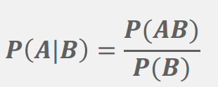
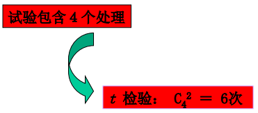
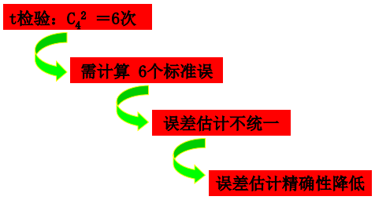

<a name="content">目录</a>

[学习笔记：生物统计学](#title)
- [概率与概率分布](#probability-and-distribution)
	- [古典概型](#classical-model)
	- [概率计算](#caculate-probability)
	- [概率分布](#probability-distribution)
	- [总体特征数](#whole-feature-value)
	- [几种常见的理论分布](#common-distributions)
		- [二项分布](#binomial-distribution)
		- [泊松分布](#poisson-distribution)
		- [正态分布](#normal-distribution)
- [方差分析：ANOVA](#anova)
	- [n次t检验的缺点](#disadvantage-of-multi-t-test)

<h1 name="title">学习笔记：生物统计学</h1>

<a name="probability-and-distribution"><h2>概率与概率分布 [目录](#content)</h2></a>

概率的统计定义：
> 在相同条件下进行n次重复试验，如果随机事件A发生的次数为m，那么m/n称为随机事件A的频率,当试验重复数n逐渐增大时，随机事件A的频率越来越稳定地接近某一数值p，那么就把 p 称为随机事件A的概率
>   
> 这样定义的概率称为**统计概率**(statistics probability)或**后验概率**(posterior probability)

<a name="classical-model"><h3>古典概型 [目录](#content)</h3></a>

古典概型（classical model)的特征：
> - 试验的所有**可能结果只有有限个**，即样本空间中的基本事件只有有限个;
> - 各个试验的可能结果出现的可能性相等，即所有基本事件的发生是**等可能**的;
> - 试验的所有可能结果**两两互不相容**

<a name="caculate-probability"><h3>概率计算 [目录](#content)</h3></a>

- 概率的加法法则

P(A∪B)=P(A)+P(B) - P(A∩B)

- 条件概率

- 概率乘法法则

P(AB)=P(A|B)P(B)

P(AB)=P(B|A)P(A)

- 全概率公式

- 贝叶斯公式

<a name="probability-distribution"><h3>概率分布 [目录](#content)</h3></a>

- **离散型随机变量**

- **连续型随机变量**

当试验资料为连续型变量，一般通过分组整理成频率分布表。如果从总体中抽取样本的容量n相当大，则频率分布就趋于稳定，我们将它近似地看成总体概率分布

<table>
<tr>
	<td></td>
	<td></td>
</tr>
</table>

当n无限大时，频率转化为概率，频率密度也转化为概率密度，阶梯形曲线也就转化为一条光滑的连续曲线，这时**频率分布**也就转化为**概率分布**了

曲线函数f(x)称为概率密度函数

分布函数F(x)定义：

<a name="whole-feature-value"><h3>总体特征数 [目录](#content)</h3></a>

- **离散型随机变量的期望与方差**

期望：E(x) = Σ xipi

方差：D(x) = Σ [ xi - E(x) ] 2 pi

- **连续型随机变量的期望和方差**

<a name="common-distributions"><h3>几种常见的理论分布 [目录](#content)</h3></a>

<a name="binomial-distribution"><h4>二项分布形式 (binomial distribution) [目录](#content)</h4></a>

n重贝努里试验 (Bernoulli trials) 为二项分布形式

在n重贝努利试验中，事件A恰好发生k(0≤k≤n)次的概率为

- **二项分布的形状**

当p值较小且n不大时，分布是偏倚的。随n的增大，分布趋于对称；

当p值趋于0.5时，分布趋于对称

- **期望与方差**

μ ＝ np

σ = sqrt(np(1-p))

<a name="poisson-distribution"><h4>波松分布 (poisson distribution) [目录](#content)</h4></a>

用来描述和分析随机地发生在单位空间或时间里的稀有事件的概率分布

服从波松分布的随机变量：

> - 一定畜群中某种患病率很低的非传染性疾病患病数或死亡数
> - 畜群中遗传的畸形怪胎数
> - 每升饮水中大肠杆菌数

若随机变量 x(x=k) 只取零和正整数值 0， 1， 2， … ，且其概率分布为

对于小概率事件，可用泊松分布描述其概率分布

二项分布当p<0.1和np<5时，可用泊松分布来近似

- **波松分布的形状**

λ是波松分布所依赖的唯一参数。 λ值愈小分布愈偏倚， 随着λ的增大 ， 分布趋于对称。 当λ=20时分布接近于正态分布；当λ=50时， 可以认为波松分布呈正态分布。 所以在实际工作中，当 **λ≥20** 时就可以用正态分布来近似地处理波松分布的问题。

- **波松分布的期望与方差**

μ= σ 2 = λ

- **波松分布的概率计算**

从所观察的随机样本中计算出相应的样本平均数作为 λ 的估计值，将其代替公式中的λ

<a name="normal-distribution"><h4>正态分布 (normal distribution) [目录](#content)</h4></a>

正态分布也称为高斯分布(Gauss distribution)

标准正态分布

<a name="anova"><h2>方差分析：ANOVA [目录](#content)</h2></a>

用以检验两个或多个均数间差异的假设检验方法

<a name="disadvantage-of-multi-t-test"><h3>n次t检验的缺点 [目录](#content)</h3></a>

**是否可行？**

> 可以把多组数据化成n个两组数据（化整为零），用n次t检验来完成这个多组数据差异显著性的判断

- 1\. 检验过程烦琐

- 2\. 无统一的试验误差，误差估计的精确性和检验的灵敏性低

- 3\. 推断的可靠性低，检验时犯α错误概率大

例如我们用t检验的方法检验4个样本平均数之间的差异显著性

